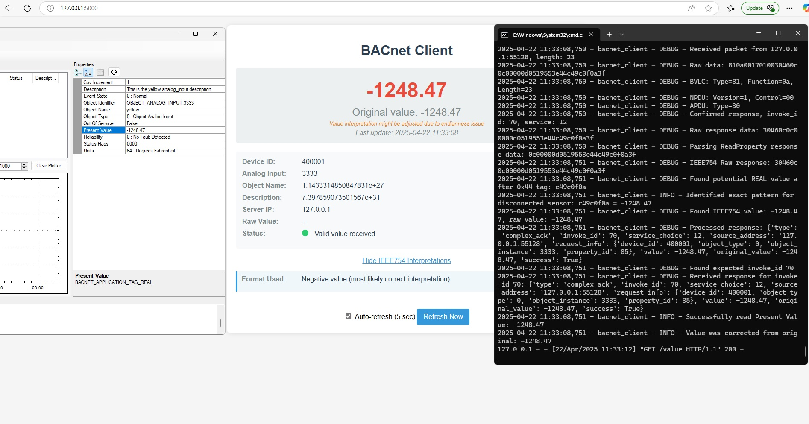
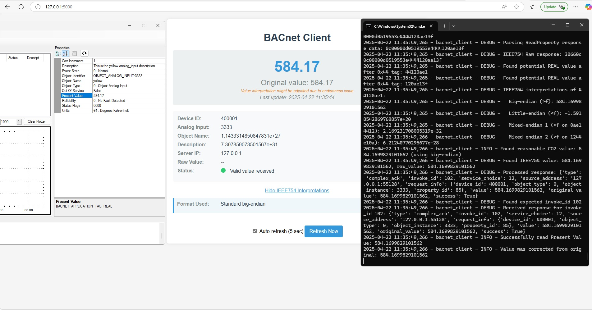

<p align="center">

</p>

<p align="center">

</p>

# BACnet Client for CO2 Monitoring

## Overview

This Python script acts as a BACnet/IP client designed primarily to monitor an Analog Input object (typically representing a CO2 sensor) on a BACnet-compatible device. It features a simple web interface to display the current value and provides basic API endpoints. The client includes specific handling for data formats used by Automated Logic Corporation (ALC) controllers and supports various BACnet features like device discovery, property reading (single and multiple), COV subscriptions, TrendLog reading, BBMD registration, and experimental BACnet/SC connectivity.

## Features

*   **BACnet/IP Communication:** Uses UDP for standard BACnet/IP communication.
*   **Device Discovery:** Implements Who-Is requests and processes I-Am responses.
*   **Property Reading:** Supports `ReadProperty` and `ReadPropertyMultiple` services.
*   **ALC IEEE754 Handling:** Includes specific logic to decode IEEE754 floating-point values from ALC controllers, correctly interpreting the `3E44XXXX3F` pattern and the disconnected sensor value (`-1248.47`).
*   **COV Subscriptions:** Can subscribe to Change of Value (COV) notifications using `SubscribeCOV` and process incoming notifications.
*   **TrendLog Reading:** Implements `ReadRange` to fetch data from TrendLog objects (by time or by position).
*   **BBMD Support:** Can register as a Foreign Device with a BACnet Broadcast Management Device (BBMD) for operation across routed networks.
*   **BACnet/SC Support (Experimental):** Contains code for connecting to a BACnet Secure Connect hub via WebSockets (WSS/TLS). Requires optional dependencies (`websockets`, `cryptography`).
*   **Web Server:** Runs a simple local HTTP server (`index.html`) to display the current sensor value, object name, description, and status.
*   **Basic API:** Provides endpoints:
    *   `/` or `/index.html`: Main HTML interface.
    *   `/value` or `/api/value`: Returns current data as JSON (value, timestamp, name, description, config details, original value if corrected).
    *   `/api/objects`: (Potentially returns discovered objects - implementation might vary).
    *   `/api/bacnet/who-is`: Triggers a Who-Is request (for testing/discovery).
*   **Configuration:** Loads settings from `config.cfg`. Automatically creates a default config if not found.
*   **Logging:** Logs events to both console and a file (`logs/co2_bacnet_client.log`) with configurable level and rotation.
*   **Packet Capture (Optional):** Can capture BACnet traffic to a `.pcap` file using Scapy. Requires `scapy` installation and administrator privileges.
*   **Polling:** Periodically polls the configured device/object for the Present Value. Includes basic reconnection logic on repeated failures.
*   **Graceful Shutdown:** Handles SIGINT/SIGTERM signals for clean shutdown.

## Dependencies

*   Python 3.6+
*   **Optional:**
    *   `websockets`, `cryptography`: For BACnet/SC support.
    *   `scapy`: For packet capture functionality.

Install dependencies from the requirements file:
```bash
pip install -r requirements.txt
```

Install optional dependencies if needed:
```bash
pip install websockets cryptography scapy
```

## Configuration (`config.cfg`)

The client is configured via the `config.cfg` file. Key sections include:

*   `[Network]`: Target BACnet device/network IP and port, local IP/port, broadcast usage, BBMD settings (if used).
*   `[BACNet_Device]`: Target `device_id` and `analog_input_instance` to poll.
*   `[WEB_Server]`: IP and port for the local web interface.
*   `[Polling]`: Polling interval, failure threshold for reconnection attempts, stale data threshold for UI.
*   `[Logging]`: Enable/disable logging, log level, file rotation settings.
*   `[Capture]`: Enable/disable packet capture, output file path.
*   `[BACnet]`: Client's own BACnet identity settings (Vendor ID, Device Name, etc.).

A default `config.cfg` will be created if one doesn't exist upon first run. **Remember to edit it** with the correct target IP address, device ID, and analog input instance for your setup.

## Usage

1.  **Install Python 3** if you haven't already.
2.  **Install optional dependencies** if needed (see Dependencies section).
3.  **Create directories:** Ensure `logs` and `captures` directories exist in the same folder as the script:
    ```bash
    mkdir logs
    mkdir captures
    ```
4.  **Configure `config.cfg`:** Edit the file with your specific network and device settings. Pay close attention to `target_ip`, `device_id`, and `analog_input_instance`.
5.  **Run the script:**
    ```bash
    python co2_bacnet_client.py
    ```
    *   To enable packet capture (if `scapy` is installed and configured), run the script with administrator/root privileges.

## Project Structure

```
.
├── co2_bacnet_client.py    # Main BACnet client script
├── index.html              # Simple HTML web interface
├── config.cfg              # Configuration file
├── requirements.txt        # Python dependencies
├── README.md               # This file
├── logs/                   # Directory for log files (created automatically)
│   └── co2_bacnet_client.log
└── captures/               # Directory for packet captures (created automatically)
    └── bacnet_capture.pcap   # Example capture file
```

## Web Interface & API

*   **Web Interface:** Access the simple web UI by navigating to `http://<WEB_Server_IP>:<WEB_Server_Port>` (e.g., `http://localhost:5000` by default) in your web browser. It displays the latest value, object info, and status.
*   **API Endpoint:** Get the current data in JSON format by accessing `http://<WEB_Server_IP>:<WEB_Server_Port>/value`.

## Logging

Logs are written to:
*   The console.
*   The file specified in `config.cfg` under `[Logging]`, typically `logs/co2_bacnet_client.log`. Log rotation is configured in the same section.

## Troubleshooting / Notes

*   **Permissions:** Running with administrator/root privileges might be necessary for binding to lower port numbers or for packet capture.
*   **Firewall:** Ensure your firewall allows UDP traffic on the configured BACnet ports (default 47808, 47809) and TCP traffic for the web server port (default 5000).
*   **Endianness Issues:** The script specifically tries to handle potential byte order (endianness) issues when decoding IEEE754 floating-point values, particularly for ALC devices. The web interface indicates if the displayed value might have been corrected from an alternative interpretation.
*   **No Device Found:** If the client fails to read data, check logs for `Who-Is` responses and ensure the `device_id` in `config.cfg` matches an existing device on the network or set `UseBroadcast = True`.
*   **Packet Capture:** Use tools like Wireshark to analyze the `.pcap` file generated in the `captures` directory (if enabled) for deeper network diagnostics.

## License

MIT License 